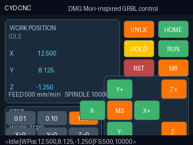

# CYD CNC

ESP32-2432S028 ("Cheap Yellow Display") firmware for driving a GRBL-based desktop CNC such as the Genmitsu 3018-PRO from a 320x240 touch screen.



## What is included

- A PlatformIO firmware project for the ESP32-2432S028
- A DMG Mori-inspired operator screen with:
  - GRBL status display
  - X/Y/Z work position readout
  - touch jogging
  - hold / run / unlock / home / reset controls
  - spindle and coolant toggles
  - work zero shortcuts

> Note: this project intentionally uses an original industrial-style layout instead of copying DMG Mori branding or an exact copyrighted screen design.

## Hardware target

- ESP32-2432S028 2.8" ILI9341 + XPT2046 touch display
- Genmitsu 3018-PRO or other GRBL controller that exposes a TTL serial connection

## Default wiring

The Cheap Yellow Display pins are already configured in `src/main.cpp` for the common ESP32-2432S028 layout:

- TFT MOSI: GPIO 13
- TFT MISO: GPIO 12
- TFT SCK: GPIO 14
- TFT CS: GPIO 15
- TFT DC: GPIO 2
- Backlight: GPIO 21
- Touch CS: GPIO 33
- Touch IRQ: GPIO 36

GRBL serial defaults:

- ESP32 RX2 (from GRBL TX): GPIO 16
- ESP32 TX2 (to GRBL RX): GPIO 17
- Baud: `115200`

## Important electrical note

Many GRBL boards expose 5V TTL serial. The ESP32 is a 3.3V device. Use a proper level-shifted connection or verify that your controller board's UART pins are 3.3V-safe before wiring the CYD directly.

## Flash instructions

1. Install [PlatformIO Core](https://platformio.org/install) or VS Code + PlatformIO.
2. Connect the ESP32-2432S028 with USB.
3. From the repository root, build the firmware:

   ```bash
   platformio run
   ```

4. Flash it:

   ```bash
   platformio run --target upload
   ```

5. Open a serial monitor if you want to inspect boot output:

   ```bash
   platformio device monitor --baud 115200
   ```

## Using the interface

- `UNLK` sends `$X`
- `HOME` sends `$H`
- `HOLD` sends the GRBL real-time `!` command
- `RUN` sends the GRBL real-time `~` command
- `RST` sends GRBL soft reset (`Ctrl+X`)
- `X+ / X- / Y+ / Y- / Z+ / Z-` send incremental `$J=` jog moves
- `0.01 / 0.10 / 1.00` select jog step in millimeters
- `X=0 / Y=0 / Z=0` send `G10 L20 P1 ...` work-offset zeroing
- `M3` toggles spindle on/off (`M3 S10000` / `M5`)
- `M8` toggles coolant on/off (`M8` / `M9`)

The footer shows the latest GRBL response or the last command sent from the touch interface.

## Calibration and customization

Touch calibration and pin definitions live at the top of `src/main.cpp`. If your display variant is mirrored or offset, adjust:

- `kTouchRawMinX`
- `kTouchRawMaxX`
- `kTouchRawMinY`
- `kTouchRawMaxY`
- `kTouchSwapAxes`
- `kTouchInvertX`
- `kTouchInvertY`

You can also change:

- `kGrblRxPin`
- `kGrblTxPin`
- `kGrblBaud`
- the default spindle speed used by the `M3` button
